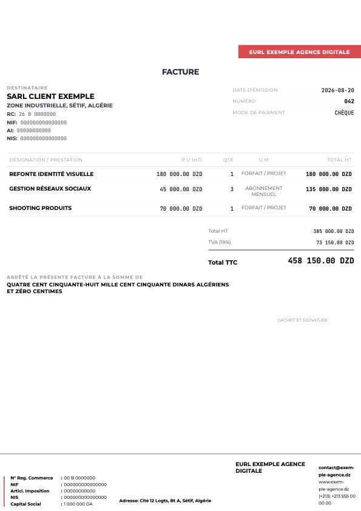
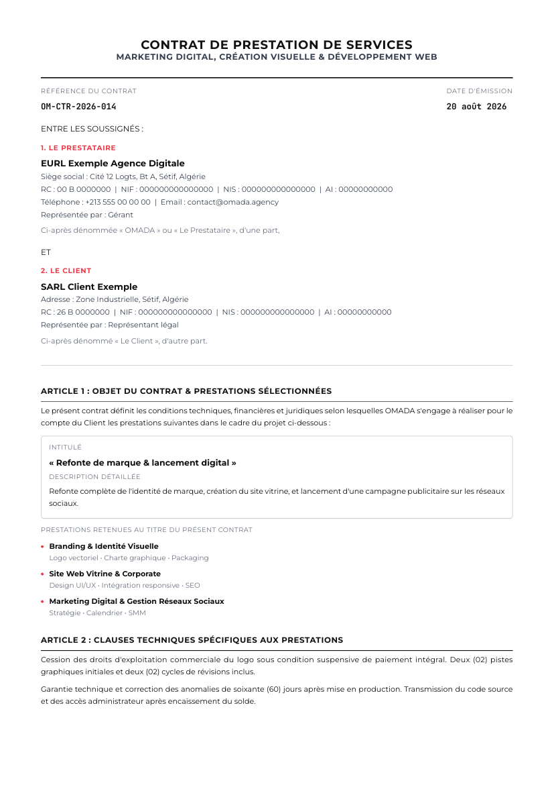
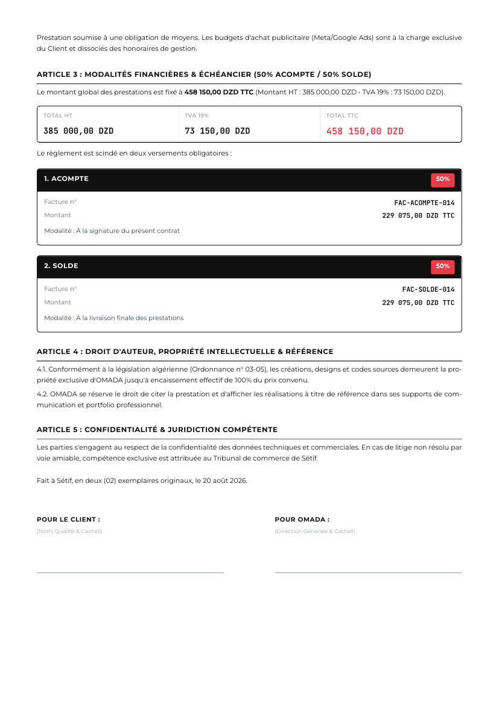

# Showcase

## PDF output — real documents, rendered from the actual templates

Live app screenshots weren't possible in this environment (see below), but Sordi's PDF documents don't need a screen at all: `InvoicePDFDocument.tsx` and `ContractPDFDocument.tsx` are pure `@react-pdf/renderer` components, so they can be rendered directly from Node with no browser, no Tauri runtime, and no GUI. These are the **real, unmodified production components** — nothing about their code was changed for this — fed fictional sample data (a fake agency and a fake client; no real business information anywhere).

| File | What it shows |
|---|---|
| [`pdfs/sample-invoice.pdf`](./pdfs/sample-invoice.pdf) | `InvoicePDFDocument` ("Structure" theme) — a 3-line agency invoice: identity/branding, social media management, and a product shoot, with TVA 19% and the amount spelled out in words. |
| [`pdfs/sample-contract.pdf`](./pdfs/sample-contract.pdf) | `ContractPDFDocument` — a full bespoke 50/50-milestone services contract: Articles 1–5, three selected services (Branding, Site Vitrine, Marketing Digital), an Acompte/Solde payment split table, and signature blocks. |

Rendered previews (page 1 of each, plus the contract's page 2):







**How these were produced**: a small standalone script imported the real `InvoicePDFDocument` and `ContractPDFDocument` components with their exact prop shapes (`PDFInvoice`/`PDFSettings` from `invoicePdfShared.ts`, `ContractPDFProps` from `ContractPDFDocument.tsx`), bundled through `esbuild` to resolve the app's `@/` path alias, and rendered via `@react-pdf/renderer`'s Node-side `renderToFile` — the same rendering path the app itself uses (`pdf()` in `pdfGenerator.ts`), just invoked outside the Tauri/browser context. The script and sample data were discarded after use; only the output PDFs and their PNG previews are kept here.

**One real finding along the way**: the contract PDF's footer always prints `contact@omada.agency` regardless of which company generated it (`ContractPDFDocument.tsx` line ~235) — `ContractPDFParty` has no `email` field, so this is hardcoded rather than pulled from settings. Left unfixed here since this was a documentation task, not a code change; worth a follow-up.

## Live-app screenshots — not possible in this environment

A genuine attempt was made to also capture the running app's own window (Dashboard, Invoices list, Settings, etc.), separate from PDF output. It failed for environment/permissions reasons documented below, not for lack of trying. No live-app screenshots are included, and nothing below is a fabricated or imagined description of what one "would" show — see [`docs/ui-ux/pages.md`](../ui-ux/pages.md) and [`docs/ui-ux/design-language.md`](../ui-ux/design-language.md) for the written descriptions used instead, grounded directly in the app's source code.

## What was checked

1. **Is Sordi running?** Yes. `osascript -e 'tell application "System Events" to get name of every process whose name contains "Sordi"'` returned a match, and `ps aux` confirmed a live process: `/Applications/Sordi.app/Contents/MacOS/sordi` (PID 65264), already running before this task started.

2. **Can screen content be captured?** No.
   ```
   $ screencapture -x <path>.png
   could not create image from display

   $ screencapture -l0 -x <path>.png
   could not create image from window

   $ screencapture -D1 -x <path>.png
   could not create image from display
   ```
   Every variant of macOS's built-in `screencapture` CLI failed with the same class of error, which on modern macOS indicates the calling process has not been granted **Screen Recording** permission in System Settings → Privacy & Security. This permission cannot be granted from within a non-interactive tool session — it requires a human to approve a system permission dialog (or pre-authorize the specific application in Settings).

3. **Is any GUI/accessibility automation available as a fallback?**
   ```
   $ osascript -e 'tell application "System Events" to get UI elements enabled'
   false

   $ osascript -e 'tell application "System Events" to tell process "sordi" to get name of every window'
   64:68: execution error: System Events got an error: osascript is not allowed assistive access. (-1728)
   ```
   Accessibility (UI Events) access is disabled for the calling process, and macOS explicitly refused the `osascript`/System Events automation attempt with error -1728 ("not allowed assistive access"). This rules out even a non-visual automation path (e.g. driving the app's menus/windows via AppleScript/System Events to at least confirm navigation, let alone capture pixels).

4. **Is there an existing test/automation harness for the desktop app?** No — confirmed by inspection of the repository: there is no Playwright, WebDriver, `tauri-driver`, or similar end-to-end automation setup wired into `apps/desktop`. The only automated testing referenced anywhere is Rust-side (`#[cfg(test)]` unit/integration tests using `tauri::test`'s mock runtime), which never renders real UI and could not have produced screenshots even if invoked.

## Why this wasn't worked around

Per the task's own instructions: if accessibility/screen-recording permissions aren't available and no automation driver exists, the correct action is to stop attempting to force it and document the gap clearly rather than fabricate or hallucinate screenshot content. That is what this document does. Force-installing a new automation tool or attempting to bypass macOS's permission model was not attempted, since:
- Granting Screen Recording/Accessibility permission requires interactive confirmation in a system dialog that this tool session cannot click through.
- Building a bespoke Tauri/WebDriver automation harness from scratch was outside the scope of a documentation task and would constitute a nontrivial, unrequested engineering change to the project.

## What to do instead, if real screenshots are wanted later

Someone with interactive access to this Mac (or the machine's owner) can:
1. Open **System Settings → Privacy & Security → Screen Recording**, and enable it for the terminal application or IDE actually issuing the `screencapture`/automation commands (e.g. Terminal.app, iTerm, or the specific tool's host process).
2. Likewise enable **Accessibility** for that same application if UI-driven navigation (rather than manual clicking) is wanted.
3. Re-run a capture pass — at that point `screencapture -x` against the already-running Sordi.app window, or an AppleScript/System-Events-driven navigation-and-capture loop, should work without further changes to this repository.

## Fallback: written UI/UX documentation

In place of screenshots, the following documents describe every key screen (Dashboard, Invoices, Contracts, Clients, Settings, Auth, Projects, Payroll, Partners, and the rest) based on a direct reading of their React source files — real layout structure, real French copy/labels, real component names — rather than a generic or invented description:

- [`docs/ui-ux/pages.md`](../ui-ux/pages.md) — screen-by-screen descriptions.
- [`docs/ui-ux/design-language.md`](../ui-ux/design-language.md) — colors, typography, sidebar structure, all sourced from the actual CSS tokens and component code.

## A note on data sensitivity

Before any capture attempt, the local database was checked (`~/Library/Application Support/com.sordi.app/database.db` via `sqlite3`) specifically because the task required pausing to ask before screenshotting real business data. At the time of this check it contained minimal seed/test data — one client ("ARCHI DESIGN") and one invoice — plus Omada Agency's own real company registration (NIF/NIS/RC), which is the business's own configuration data for the app it uses, not third-party client data. This turned out to be moot once screen capture proved impossible, but is recorded here for completeness in case capture is retried later: the database should be re-checked at that time in case real production data has since been entered.
